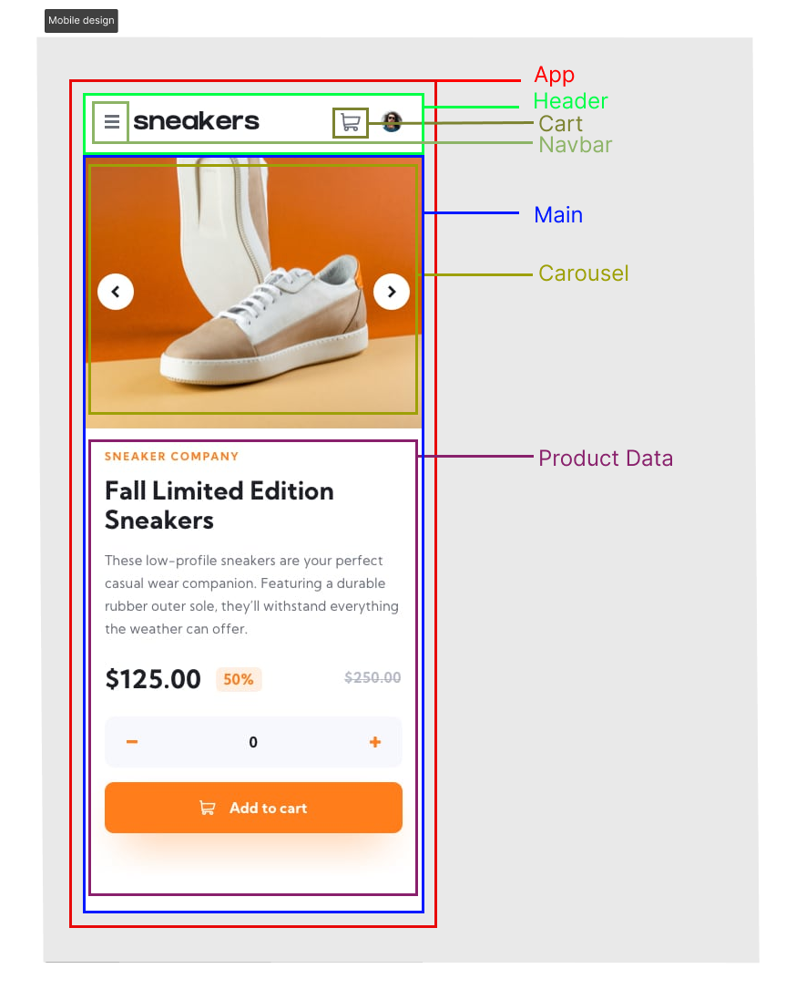
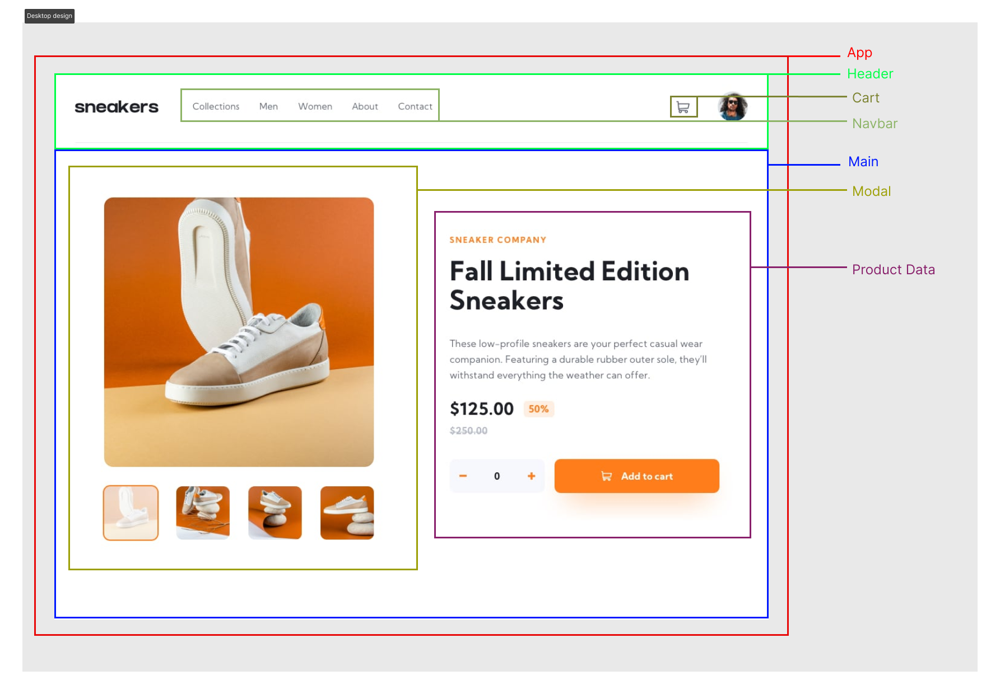

<h2>Project : E-commerce product page from Frontend Mentor</h2>

<a target="/blank" href="https://e-commerce-product-page-novecento.netlify.app/">Online Website</a>

 

---

 

<h3>Disclaimer :</h3>

Il progetto da realizzare è una pagina con i dettagli di un prodotto, in un uso reale il progetto avrebbe una struttura fondalmentalmente diversa (utilizzo di router e fetching dei dati basato sull'url).
Ho deciso di mostrare i dati quali, nome del prodotto, prezzo e sconto in maniera dinamica (simulando un fetching di dati da un server) e non statica.

Per ottenere l'url per fetchare i dati eseguire questo comando =>
npx json-server --watch data/db.json --port 8000

 

---

 

<h2>Lavorazione</h2>

<h3>Tecnologie utilizzate</h3>
<ul>
  <li>Html, css, react</li>
  <li>Git e github </li>
  <li>Vite come bundler</li>
  <li>Netify per deploy</li>
</ul>

 

---

 

<h3>Ho diviso i componenti in:</h3>
<ul>
  <li>App
      <ul>
        <li>Header
          <ul>
              <li>Navbar</li>
              <li>Cart</li>
          </ul>
        </li>
        <li>Loading</li>
        <li>Main
            <ul>
                <li>Modal</li>
                <li>Carousel</li>
                <li>ProductInfo</li>
            </ul>
        </li>
      </ul>
  </li>
</ul>

 

---

 

<h3>Rendering condizionale</h3>

Il componente Header verrà mostrato sempre, mentre Main verrà mostrato solo quando il fetching deti dati sarà completato, altrimenti mostrerà il Loading component

Il componente carousel verrà mostrato solo a dimensioni inferiori di 649px, al suo posto in versione tablet - desktop ci sarà il componente modal

 

---

 

<h2> Metodologia applicata per progettare il progetto di react </h2>

<h3>1- Suddividere l'interfaccia utente in una gerarchia di componenti</h3>

<h4>Mobile design</h4>
  

<h4>Desktop design</h4>
  

<h3>2- Creare una verisone statica in react</h3>

<h3>3- Identificare dove devono vivere i dati e in che modo</h3>

Context =>

- Array di cart item's | state
- Loading | state

Product data =>

- Oggetto "item" da inserire nel cart, con nome, quantita, prezzo e sconto | props ottenuto da main che fetcha i dati
